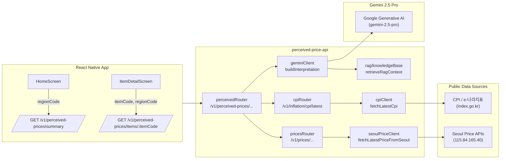

# AI & RAG Architecture: Perceived Price Monitoring MVP

> 이 문서는 `001-perceived-price-mvp` 스펙의 **AI / RAG / 공공데이터 통합 설계**를 기술합니다.  
> 구현 기준 브랜치: `apps/mobile-perceived-price` (RN 앱), `apps/perceived-price-api` (Node/Express 백엔드)

---

## 1. 목표

- 사용자가 선택한 품목과 지역에 대해 **실제 가격 vs. 체감 기준 가격대**를 비교하고,
- “왜 이렇게 비싸게/저렴하게/비슷하게 느껴지는지”를 **자연어 해석 카드**로 설명하며,
- 서울시 물가 API + 국가 CPI 등 **공공데이터를 안전하게 활용**하면서,
- **Gemini 2.5 Pro + RAG**를 사용해 설명 품질을 높이되, 숫자 계산은 항상 코드에서 결정적으로 수행하는 것을 목표로 합니다.

---

## 2. 전체 구조 개요



---

## 3. 데이터 모델 (AI 관점)

AI 관련 로직에서 사용하는 핵심 타입들은 다음과 같습니다.

### 3.1 Perceived Price Detail

```ts
// apps/mobile-perceived-price/app/src/types/index.ts
export type Region = {
  code: string;           // "SEOUL_GANGSEO"
  name: string;           // "Seoul · Gangseo-gu"
  level: 'city' | 'district';
  parentCode: string;
};

export type PerceivedPriceBaseline = {
  itemCode: string;       // "RICE_10KG"
  regionCode: string;     // "SEOUL_GANGSEO"
  lowerBound: number;     // 기억 가격 하한
  upperBound: number;     // 기억 가격 상한
  currency: 'KRW';
  referencePeriodLabel: string; // "최근 12개월"
};

export type InterpretationCard = {
  id: string;
  title: string;
  body: string;
  createdAt: string;
};

export type PerceivedPriceDetail = {
  region: Region;
  baseline: PerceivedPriceBaseline;
  actualPrice: number;
  currency: 'KRW';
  interpretation: InterpretationCard;
};
```

### 3.2 CPI Snapshot

```ts
// apps/perceived-price-api/src/clients/cpiClient.ts
export type CpiSnapshot = {
  date: string;
  headlineCpiYoY: number;
  coreCpiYoY: number;
  livingPriceIndexYoY: number;
};
```

### 3.3 Gemini 입력/출력 타입

```ts
// apps/perceived-price-api/src/clients/geminiClient.ts
export type RegionSummary = {
  code: string;
  name: string;
  level: 'city' | 'district';
  parentCode: string | null;
};

export type PerceivedBaseline = {
  itemCode: string;
  regionCode: string;
  lowerBound: number;
  upperBound: number;
  currency: 'KRW';
  referencePeriodLabel: string;
};

export type InterpretationInput = {
  itemCode: string;
  region: RegionSummary;
  baseline: PerceivedBaseline;
  actualPrice: number;
  macro: CpiSnapshot;
  locale?: 'ko' | 'en';
};

export type InterpretationResult = {
  id: string;
  title: string;
  body: string;
  createdAt: string;
};
```

---

## 4. RAG 파이프라인

### 4.1 지식 베이스 구조

```ts
// apps/perceived-price-api/src/rag/knowledgeBase.ts
export type RagDocument = {
  id: string;
  title: string;
  body: string;
  tags: string[];
};

export type RagQuery = {
  topic: 'cpi' | 'living-price-index' | 'general-inflation';
  locale: 'ko' | 'en';
  limit?: number;
};
```

현재는 다음과 같은 문서들이 하드코딩되어 있으며, 태그 기반으로 간단히 검색합니다:

- `cpi-basic-ko`: CPI 기본 개념
- `living-index-vs-cpi-ko`: 생활물가지수 vs 소비자물가지수
- `inflation-perception-ko`: 체감 물가 심리 설명

향후에는:

- 문서 수집 → Chunking → Embedding(Gemini) → Vector DB 저장 → Top‑k 검색  
  의 전형적인 RAG 파이프라인으로 교체합니다.

### 4.2 Retrieval 함수

```ts
export function retrieveRagContext(query: RagQuery): RagDocument[] {
  const limit = query.limit ?? 3;
  const topicTag =
    query.topic === 'cpi'
      ? 'cpi'
      : query.topic === 'living-price-index'
      ? 'living-price-index'
      : '체감물가';

  return docs.filter((doc) => doc.tags.includes(topicTag)).slice(0, limit);
}
```

---

## 5. Gemini 2.5 Pro 통합 로직

### 5.1 환경 변수

```env
# apps/perceived-price-api/.env
GEMINI_API_KEY=YOUR_GEMINI_KEY
GEMINI_MODEL_NAME=gemini-2.5-pro   # 지정하지 않으면 기본 'gemini-1.5-pro'
```

### 5.2 Fallback 해석 로직 (결정적 계산)

```ts
// apps/perceived-price-api/src/clients/geminiClient.ts
export function generatePerceivedInterpretationFallback(
  input: InterpretationInput
): InterpretationResult {
  const { itemCode, region, baseline, actualPrice, macro, locale = 'ko' } = input;

  const midpoint = (baseline.lowerBound + baseline.upperBound) / 2;
  const diff = actualPrice - midpoint;
  const diffPercent = (diff / midpoint) * 100;

  const direction =
    diffPercent > 5 ? '비싸게' : diffPercent < -5 ? '저렴하게' : '비슷하게';

  const macroSentence =
    macro.livingPriceIndexYoY > macro.headlineCpiYoY
      ? '생활물가지수 상승률이 전체 소비자물가지수보다 높아, 체감 물가가 더 가파르게 오르고 있습니다.'
      : '전체 소비자물가지수와 생활물가지수가 비슷한 수준으로 움직이고 있습니다.';

  const contextDocs: RagDocument[] = retrieveRagContext({
    topic: 'living-price-index',
    locale,
    limit: 2
  });

  const contextText =
    contextDocs.length > 0
      ? '\n\n참고로, 다음 설명도 함께 볼 수 있어요:\n' +
        contextDocs
          .map((doc) => `- ${doc.title}: ${doc.body}`)
          .join('\n')
      : '';

  const body =
    `${region.name}에서 ${itemCode}의 최근 가격은 ${actualPrice.toLocaleString()}원으로, ` +
    `지난 ${baseline.referencePeriodLabel} 동안 기억해 둔 가격대(약 ${baseline.lowerBound.toLocaleString()}~${baseline.upperBound.toLocaleString()}원)에 비해 ` +
    `${Math.abs(diffPercent).toFixed(1)}% 정도 ${direction} 느껴질 수 있어요. ` +
    macroSentence +
    contextText;

  return {
    id: `interpretation-${itemCode}`,
    title: '왜 이렇게 비싸게 느껴질까요?',
    body,
    createdAt: new Date().toISOString()
  };
}
```

이 Fallback 로직은:

- **숫자 계산을 100% 코드에서 수행**하고,
- RAG 문서들을 간단히 붙여주는 형태입니다.

### 5.3 Gemini 호출 로직

```ts
const GEMINI_API_KEY = process.env.GEMINI_API_KEY;
const GEMINI_MODEL_NAME = process.env.GEMINI_MODEL_NAME ?? 'gemini-1.5-pro';

export async function buildInterpretation(
  input: InterpretationInput
): Promise<InterpretationResult> {
  if (!GEMINI_API_KEY) {
    return generatePerceivedInterpretationFallback(input);
  }

  try {
    const genAI = new GoogleGenerativeAI(GEMINI_API_KEY);
    const model = genAI.getGenerativeModel({ model: GEMINI_MODEL_NAME });

    const { itemCode, region, baseline, actualPrice, macro, locale = 'ko' } = input;

    const midpoint = (baseline.lowerBound + baseline.upperBound) / 2;
    const diff = actualPrice - midpoint;
    const diffPercent = (diff / midpoint) * 100;

    const contextDocs: RagDocument[] = retrieveRagContext({
      topic: 'living-price-index',
      locale,
      limit: 3
    });

    const prompt = {
      item: {
        code: itemCode,
        regionCode: region.code,
        regionName: region.name,
        baselineLower: baseline.lowerBound,
        baselineUpper: baseline.upperBound,
        actualPrice,
        diffPercent,
        currency: baseline.currency
      },
      macro: {
        headlineCpiYoY: macro.headlineCpiYoY,
        livingPriceIndexYoY: macro.livingPriceIndexYoY,
        coreCpiYoY: macro.coreCpiYoY
      },
      contextDocs,
      locale
    };

    const systemInstruction =
      '당신은 생활 물가 서비스의 해설 카드 작가입니다. ' +
      '응답은 반드시 유효한 JSON 형식으로만 반환하세요. ' +
      '숫자 계산은 입력으로 주어진 값을 그대로 사용하고, 새로운 수치를 임의로 만들지 마세요.';

    const userInstruction =
      '다음 JSON 입력을 바탕으로, 사용자가 이해하기 쉬운 한국어 해석 카드를 만들어 주세요.\n' +
      '응답 형식은 다음 JSON 스키마를 따라야 합니다.\n' +
      '{ "title": string, "body": string }\n' +
      '설명은 3~6문장 정도로, 왜 현재 가격이 비싸게/저렴하게/비슷하게 느껴지는지에 초점을 맞춰 주세요.';

    const result = await model.generateContent({
      systemInstruction,
      contents: [
        {
          role: 'user',
          parts: [
            { text: userInstruction },
            { text: JSON.stringify(prompt) }
          ]
        }
      ]
    });

    const text = result.response.text().trim();

    let parsed: { title?: string; body?: string };
    try {
      parsed = JSON.parse(text);
    } catch {
      return generatePerceivedInterpretationFallback(input);
    }

    if (!parsed.title || !parsed.body) {
      return generatePerceivedInterpretationFallback(input);
    }

    return {
      id: `interpretation-${input.itemCode}`,
      title: parsed.title,
      body: parsed.body,
      createdAt: new Date().toISOString()
    };
  } catch (err) {
    // eslint-disable-next-line no-console
    console.error('[geminiClient] failed to call Gemini, falling back to local interpretation', err);
    return generatePerceivedInterpretationFallback(input);
  }
}
```

특징:

- **입력**: `InterpretationInput` (item, region, baseline, actualPrice, macro, contextDocs)  
  → 모든 숫자 값은 코드에서 계산 후 전달.
- **출력**: `{ title, body }` 형태의 JSON만 허용.
- JSON 파싱에 실패하거나 필드가 없다면 Fallback 사용.

---

## 6. Perceived Price API 플로우

### 6.1 `/v1/perceived-prices/items/:itemCode`

```ts
// apps/perceived-price-api/src/routes/perceived.ts
perceivedRouter.get('/items/:itemCode', async (req, res) => {
  const { itemCode } = req.params;
  const regionCodeFromQuery = typeof req.query.regionCode === 'string' ? req.query.regionCode : undefined;

  try {
    const regionCode = regionCodeFromQuery ?? 'SEOUL_GANGSEO';
    const region = {
      code: regionCode,
      name: regionCode === 'SEOUL_GANGNAM' ? 'Seoul · Gangnam-gu' : 'Seoul · Gangseo-gu',
      level: 'district' as const,
      parentCode: 'SEOUL'
    };

    const latestPrice = await fetchLatestPriceFromSeoul(itemCode, region.code);
    const latestSnapshot = latestPrice.snapshots[latestPrice.snapshots.length - 1];
    const actualPrice = latestSnapshot.price;

    const baseline: PerceivedBaseline = {
      itemCode,
      regionCode: region.code,
      lowerBound: Math.round(actualPrice * 0.9),
      upperBound: Math.round(actualPrice * 1.1),
      currency: 'KRW',
      referencePeriodLabel: '최근 12개월'
    };

    const macro = await fetchLatestCpi();
    const interpretation = await buildInterpretation({
      itemCode,
      region,
      baseline,
      actualPrice,
      macro
    });

    res.json({
      region,
      baseline,
      actualPrice,
      currency: 'KRW',
      interpretation
    });
  } catch (err) {
    console.error('[perceivedRouter] failed to build perceived price detail', err);
    res.status(500).json({ message: 'Failed to build perceived price detail' });
  }
});
```

---

## 7. 테스트 및 검증 전략 (요약)

- 단위 테스트 (향후 Jest):
  - `generatePerceivedInterpretationFallback`  
    → 입력 값별 diffPercent와 direction이 의도대로 반영되는지 검증.
  - `retrieveRagContext`  
    → topic별로 적절한 문서 조합이 반환되는지 확인.
- 통합 테스트:
  - `/v1/perceived-prices/items/:itemCode`  
    - `GEMINI_API_KEY` 없는 환경 → Fallback 본문이 내려오는지.
    - Mock Gemini 응답을 통해 JSON 파싱 실패 시 Fallback으로 가는지.
- 수동 검증:
  - 실제 Gemini 2.5 Pro 연결 후, 품목/지역을 여러 조합으로 호출해  
    해석 카드 내용이 **과장 없이, 입력 숫자를 정확히 반영하는지** 리뷰.

---

이 문서는 **AI/RAG 설계의 단일 출처(Single Source of Truth)** 로 사용되며,  

